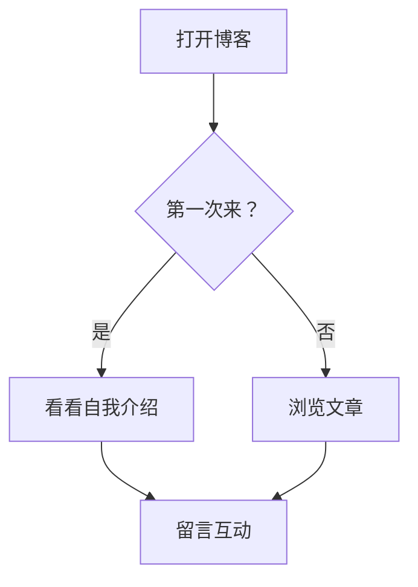
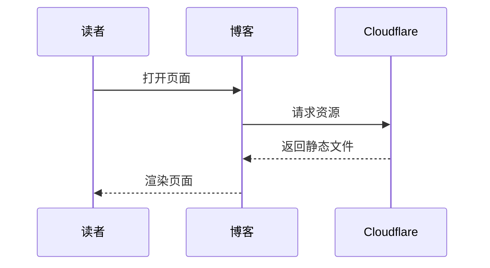
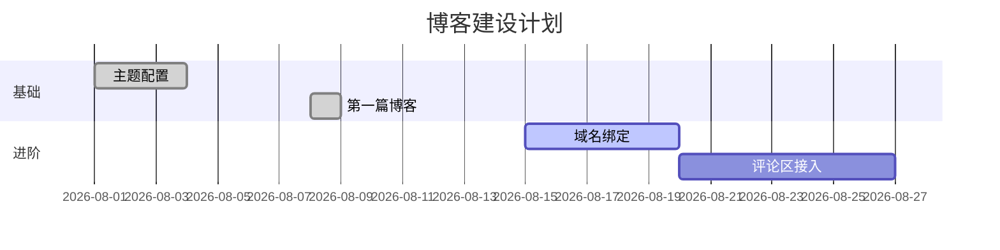

这篇文章把 Firefly 主题支持的组件都展示一遍，想用哪个直接复制代码段即可。

## 提醒框（Admonitions）

> [!NOTE]
> 普通提示：用户应该考虑的信息。

> [!TIP]
> 小技巧：帮助用户更成功的信息。

> [!IMPORTANT]
> 重要：用户成功所必需的关键信息。

> [!WARNING]
> 警告：需要立即注意的关键内容。

> [!CAUTION]
> 危险：行动的负面潜在后果。

## 表格

| 属性 | 必填 | 说明 |
|---|---|---|
| `title` | ✅ | 文章标题 |
| `published` | ✅ | 发布日期 YYYY-MM-DD |
| `tags` | ❌ | 标签列表 |
| `category` | ❌ | 文章分类 |

## 代码块

带标题和行号：

```js title="hello.js" {1-2} /console/
console.log("你好，世界！");
const name = "雪穗";
console.log(`Hello, ${name}`);
```

普通高亮：

```python
def greet(name: str) -> str:
    return f"Hello, {name}!"

print(greet("Yuki"))
```

## 折叠块

<details>
<summary>点击展开查看详细内容</summary>

这里是折叠起来的内容，适合放长代码或补充说明。

```bash
pnpm dev      # 启动开发服务器
pnpm build    # 生产构建
pnpm check    # 类型检查
```

</details>

## Mermaid 图表

### 流程图



### 时序图



### 甘特图



## 数学公式（KaTeX）

行内公式：质能方程 $E = mc^2$ 是物理学最著名的公式。

块级公式：

$$
\sum_{i=1}^{n} i = \frac{n(n+1)}{2}
$$

## 图片网格

[grid]


[/grid]

## 嵌入视频（Bilibili）

<iframe width="100%" height="468" src="//player.bilibili.com/player.html?bvid=BV1fK4y1s7Qf&p=1&autoplay=0" scrolling="no" border="0" frameborder="no" framespacing="0" allowfullscreen="true"> </iframe>

## GitHub 仓库卡片

::github{repo="CuteLeaf/Firefly"}

## 内部链接卡片（Wiki Link）

单独成段时自动渲染为卡片：

[[hello-yuki-blog]]

行内链接：欢迎阅读我的开篇 [[hello-yuki-blog|自我介绍]]。

## 剧透

这是一段 :spoiler[被隐藏的**惊喜**内容]，鼠标悬浮才能看到！

## 任务列表

- [x] 搭建博客
- [x] 写第一篇博客
- [ ] 绑定自定义域名
- [ ] 接入评论区

## 引用

> 我的天空里没有太阳，总是黑夜，但并不暗，因为有东西代替了太阳。
>
> —— 东野圭吾《白夜行》

---

以上就是全部常用组件。复制需要的代码段到你的文章里，改改内容就能用。祝写作愉快 🌿
